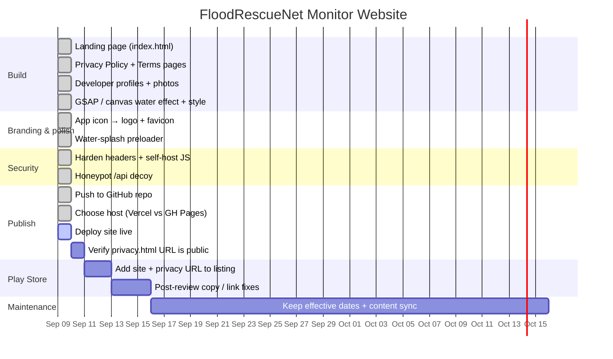

# FloodRescueNet Monitor — Website Progress Tracker

Living tracker for the Play Store companion website (`C:\D\Thesis-records\Website\`).
Update the **Session Log** every working session and adjust the **Gantt chart** dates
as tasks start / finish. Team: **Soul Grievers** — Jerenze (PM), Aenon John S. Abay
(System Programmer), Sarah G. Giamat (QA).

---

## Gantt Chart

> GitHub renders the chart automatically. To preview locally, paste the block into
> <https://mermaid.live>.

---

## Session Log

| Date | Session | What we did | Status | Next |
|------|---------|-------------|--------|------|
| 2026-09-09 | Build | Built the full site: `index.html` landing (hero, overview, features, how-it-works, developer profiles, support), standalone `privacy.html` + `terms.html` (effective 9 Sep 2026), GSAP + ScrollTrigger, rain/water canvas effect, SyWorld-style theme (Sora + Space Grotesk, dark gradient), shared `css/style.css` + `js/main.js`. App branded **FloodRescueNet Monitor**. Support email `omandamjerenze@gmail.com`. | ✅ Done | Publish it |
| 2026-09-09 | Branding & polish | Swapped in the **official app icon** (`assets/app-icon.png`, 512×512) as the site logo (nav + footer lockup) and favicon / apple-touch-icon on all 3 pages, replacing the old inline-SVG wave mark. Added a **water-splash preloader** on `index.html`: full-screen dark overlay, floating app icon, animated water rising from the bottom with a spinning wave crest, "loading" label; lifts after `window.load` + 2.2 s min, GSAP hero intro now waits for a `site:ready` event. Reduced-motion users skip it; pure-CSS + JS failsafes so it can never trap the page. Cache-busted `style.css?v=4` / `main.js?v=2`. | ✅ Done | Deploy |
| 2026-09-09 | Splash video | Replaced the CSS water crest with the real **`assets/splash.mp4`** (10 s, ~7.7 MB) as a full-bleed preloader video: `autoplay muted playsinline loop`. App icon pinned **bottom-right** (`.pl-badge`, radial-fade mask) to cover the video's corner star watermark. Overlay now lifts on `DOMContentLoaded` + 2.6 s min (video does **not** block the lift); CSS water effect kept as `on error` fallback (`#preloader.no-video`). `style.css?v=5`. | ✅ Done | Deploy |
| 2026-09-09 | Splash QA (Playwright) | Verified the splash in-browser at 1280×800 and 390×844. Fixed the bottom-right badge so it actually **covers the video's corner star watermark** (enlarged to `clamp(150px,34vw,220px)`, diagonal `--bg` feather solid from 32%). Moved the "loading" label to just below the centre logo so it no longer collides with the badge on phones; badge shrinks to 104px under 640px (watermark is cropped off-screen there anyway). Confirmed normal load auto-dismisses (`body.preloaded`, hero reveals) and that content sections stack correctly single-column on mobile. Debug: open `index.html?keepsplash` to freeze the splash. `style.css?v=8`. | ✅ Done | Deploy |
| 2026-09-09 | Security hardening | Reviewed the site (static, no inputs/forms/auth/storage → low surface). **Self-hosted GSAP** (`js/vendor/`) removing the cdnjs dependency; moved the inline preloader script to `js/preloader.js` so CSP needs no `script-src` exceptions. Added **`vercel.json`** security headers: strict CSP, HSTS, `X-Frame-Options: DENY`, `X-Content-Type-Options`, `Referrer-Policy`, `Permissions-Policy`, COOP/CORP. Added `.gitignore` excluding `feedback.txt` + loose source PNGs from the repo. Fixed privacy/terms brand mark to the app icon (consistency). `style.css?v=9`. | ✅ Done | Deploy |
| 2026-09-09 | Honeypot | Added a decoy `api/index.html` (self-hosted `assets/nope.png` gorilla image + "401 Unauthorized" text). `vercel.json` rewrites route `/api`, `/api/*`, `/admin`, `/wp-admin`, `/wp-login.php`, `/.env`, `/config.json`, `/phpinfo.php` to it — anyone probing for an API/admin panel gets the image. | ✅ Done | Deploy |
| 2026-09-09 | Push | `git init` in `Website/`, committed as **JerenzeLevi &lt;omandamjerenze@gmail.com&gt;** (no co-authors), pushed to `github.com/JerenzeLevi/floodrescuenet-monitor-site`. | ✅ Done | Connect repo to Vercel |
| 2026-09-09 | Docs & license | Added an aesthetic **`README.md`** (badges, structure tree, security + honeypot notes, deploy steps, team) and a strict proprietary **`LICENSE`** — All Rights Reserved, no copying / forking / reuse / redeploy of code, content, assets, or design without written permission; repo is view-for-review only. Committed as Jerenze, no co-authors. | ✅ Done | Connect repo to Vercel |
| 2026-09-09 | Publish | Host = **Vercel**, project name **`floodrescuenet-monitor-site`** (keeps it distinct from the future mobile-app repo). Import the GitHub repo → deploy (no build step). Then the Play Store URL is `https://<project>.vercel.app/privacy.html`. | 🔄 In progress | Import repo on Vercel, verify URLs, add to Play Store |
| | | | | |

_Add a new row each session. Keep newest at the bottom._

---

## Hosting Decision — Vercel vs GitHub Pages

Both are **free** and both give **HTTPS** (required by Google Play for the privacy
policy URL). This site is plain static HTML/CSS/JS, so either works.

**Recommendation: Vercel** — for this use case it is the smoother path:

| | Vercel (recommended) | GitHub Pages |
|---|---|---|
| Cost | Free (Hobby) | Free |
| Deploy method | Drag-and-drop the `Website` folder at vercel.com/new, **or** connect a Git repo — no build step needed | Requires a GitHub repo; enable Pages in settings |
| Speed | Global edge CDN, very fast | Fastly CDN, fast |
| HTTPS | Automatic | Automatic |
| URL | `flood-rescue-net.vercel.app` (rename in project settings) | `<user>.github.io/<repo>` |
| Custom domain later | Free, easy, auto SSL | Free, supported |
| Redeploy after edits | Re-drag folder or `git push` | `git push` |
| Good for | Getting a clean public URL fast without touching Git | Keeping everything in one GitHub repo |

**Pick GitHub Pages instead if** you already want this project in a GitHub repo and
prefer one place for code + hosting.

### Project / repo identity
- **Name:** `floodrescuenet-monitor-site` — the `-site` suffix keeps it separate from
  the future mobile-app repo (e.g. `floodrescuenet-monitor-app`) so the two never clash.
- **Description (GitHub "About" / Vercel project):**
  > Marketing and legal site for FloodRescueNet Monitor — the Android companion app for an ESP32-based automated flood-response system. Hosts the landing page, Privacy Policy, and Terms for Google Play.
- **Topics / labels:** `flood-monitoring` · `disaster-response` · `esp32` · `iot`
  · `landing-page` · `static-site` · `privacy-policy` · `google-play` · `thesis-project`
  · `html-css-js` · `gsap` · `saint-columban-college`

### Steps — Vercel (no Git needed)
1. Go to <https://vercel.com/signup> → sign in with GitHub/email (free Hobby plan).
2. <https://vercel.com/new> → **Deploy** → drag the whole `Website` folder in.
3. No framework / no build command — it serves the files as-is.
4. After deploy, open **Project → Settings → Domains** and rename to something clean
   like `floodrescuenet-monitor.vercel.app`.
5. Public URLs become:
   - Site: `https://floodrescuenet-monitor.vercel.app/`
   - Privacy (for Play Console): `https://floodrescuenet-monitor.vercel.app/privacy.html`
   - Terms: `https://floodrescuenet-monitor.vercel.app/terms.html`
6. To update later: edit files locally, re-drag the folder (or connect Git for
   auto-deploy on push).

### Steps — GitHub Pages (alternative)
1. Create a public repo, e.g. `floodrescuenet-monitor-site`.
2. Put the contents of `Website/` at the repo root (so `index.html` is at the top).
3. Push to the `main` branch.
4. Repo **Settings → Pages** → Source: `main` / root → Save.
5. URL: `https://<username>.github.io/floodrescuenet-monitor-site/`
   Privacy: `https://<username>.github.io/floodrescuenet-monitor-site/privacy.html`

---

## Play Store linking checklist
- [ ] Site deployed and reachable over HTTPS
- [ ] `privacy.html` opens directly (no login, no 404)
- [ ] `terms.html` opens directly
- [ ] Privacy Policy URL pasted into Play Console → App content → Privacy policy
- [ ] Website URL added to the Store listing → Contact details
- [ ] Support email on site matches the one in Play Console
